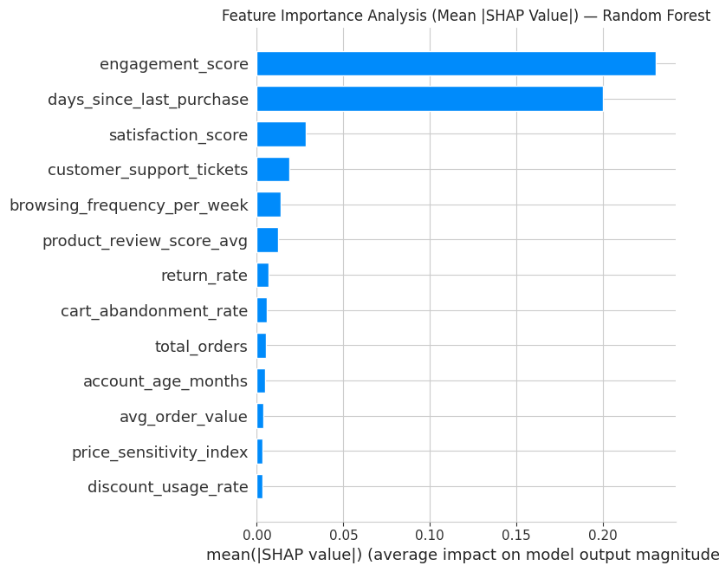
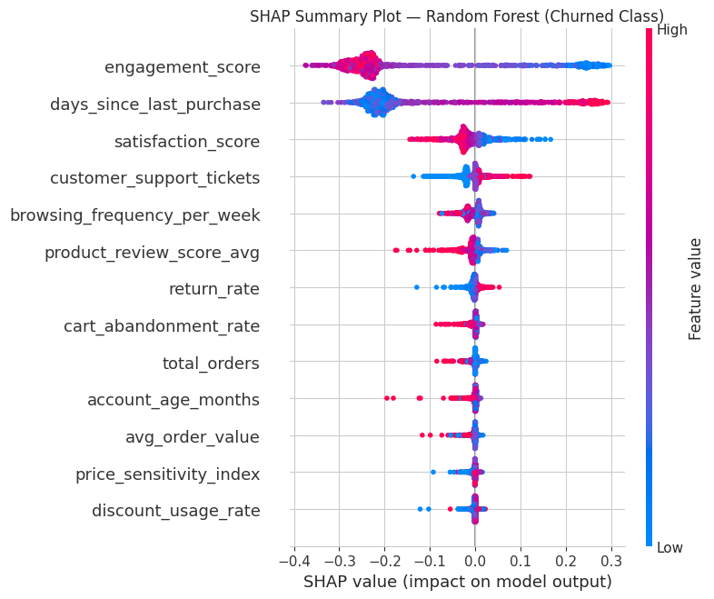
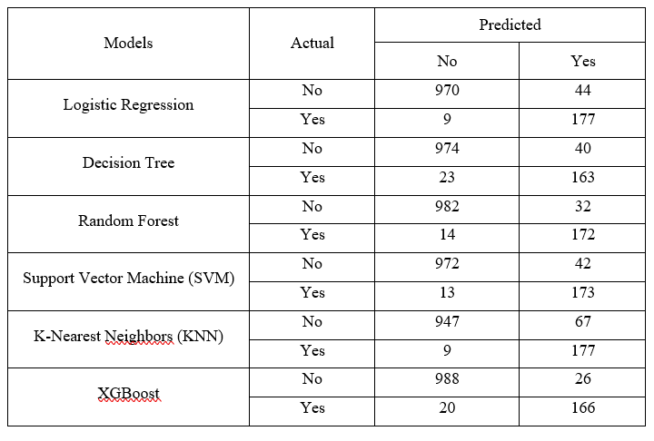
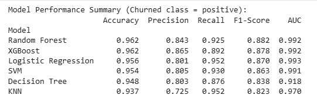
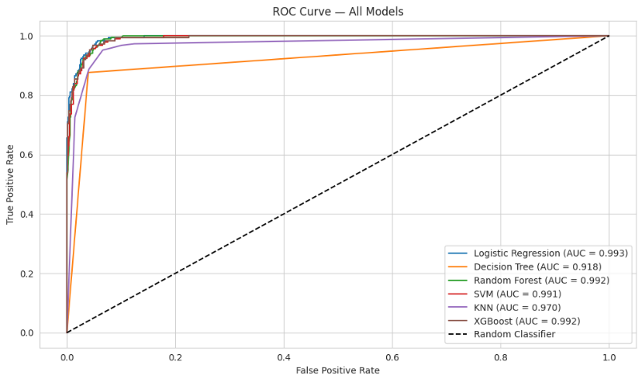

# Customer Churn Prediction Using Machine Learning


## Project Overview

This project focuses on developing machine learning models to predict customer churn in an e-commerce environment. The objective is to identify customers who are likely to leave and generate actionable insights to support customer retention strategies.

Six classification models were developed and compared, while SHAP (SHapley Additive exPlanations) was applied to improve model interpretability and identify the key factors influencing customer churn.

---

## Business Objective

Customer churn is a critical challenge for e-commerce businesses as losing existing customers can negatively impact revenue and customer lifetime value.

This project aims to:

- Predict customers at risk of churn
- Identify important customer behaviour patterns
- Support proactive customer retention decisions
- Provide interpretable machine learning insights for business actions

---

## Tools & Technologies

**Programming Language**
- Python

**Libraries**
- Pandas
- NumPy
- Matplotlib
- Seaborn
- Scikit-learn

**Techniques**
- Data Cleaning
- Exploratory Data Analysis (EDA)
- Feature Selection
- Feature Scaling
- SMOTE Class Balancing
- Machine Learning Classification
- Model Evaluation
- Explainable AI (SHAP)

---

## Dataset

The project uses an e-commerce customer churn dataset containing customer behavioural and transactional information.

### Features Include:

- Engagement Score
- Days Since Last Purchase
- Customer Satisfaction Score
- Customer Support Tickets
- Browsing Frequency
- Average Order Value
- Cart Abandonment Rate
- Product Review Score
- Account Age

### Target Variable:

```
Churned
```

- 1 = Customer churned
- 0 = Customer retained

---

# Project Workflow

## 1. Data Preprocessing

The following preprocessing steps were performed:

- Removed irrelevant features
- Checked and handled missing values
- Encoded categorical variables
- Detected and treated outliers using IQR method
- Selected important features
- Applied StandardScaler for feature normalization
- Applied SMOTE to handle class imbalance

---

# 2. Machine Learning Models

Six classification algorithms were developed:

| Model | Algorithm |
|---|---|
| Logistic Regression | Linear classifier |
| Decision Tree | Tree-based classifier |
| Random Forest | Ensemble learning |
| Support Vector Machine | Margin-based classifier |
| K-Nearest Neighbors | Distance-based classifier |
| XGBoost | Gradient boosting classifier |

---

# Model Evaluation

The models were evaluated using:

- Accuracy
- Precision
- Recall
- F1-score
- Confusion Matrix
- ROC-AUC Curve

## Performance Comparison

| Model | Accuracy |
|---|---|
| Logistic Regression | 95.6% |
| Decision Tree | 94.8% |
| Random Forest | 96.2% |
| Support Vector Machine | 95.4% |
| K-Nearest Neighbors | 93.7% |
| XGBoost | 96.2% |

---

# Champion Model: Random Forest

Random Forest was selected as the champion model due to its balanced performance across multiple evaluation metrics.

Performance:

| Metric | Score |
|---|---|
| Accuracy | 96.2% |
| Precision | 84.3% |
| Recall | 92.5% |
| F1-score | 88.2% |
| AUC | 99.2% |

---

# Explainable AI Using SHAP

SHAP (SHapley Additive exPlanations) was applied to interpret the Random Forest model by identifying the most influential features affecting customer churn predictions.

## SHAP Feature Importance



The SHAP feature importance bar plot ranks features based on their average impact on model predictions. Engagement Score, Days Since Last Purchase, and Customer Satisfaction Score were identified as the most influential variables.

---

## SHAP Summary Plot



The SHAP summary plot illustrates both the importance and direction of each feature's influence on churn predictions. Features with higher SHAP values have a greater impact on the model's output, while the colour distribution indicates whether high or low feature values increase the likelihood of customer churn.

---

## Key Churn Drivers

The most important features identified were:

1. Engagement Score
2. Days Since Last Purchase
3. Customer Satisfaction Score
4. Customer Support Tickets
5. Browsing Frequency

SHAP analysis helped transform machine learning predictions into meaningful business insights.

---

# Model Performance Comparison

## Confusion Matrix



## Mutli-Model Performance Summary



## ROC Curve



---
# Business Insights

The analysis suggests that:

- Customers with lower engagement levels have a higher probability of churn
- Longer periods since the last purchase indicate increasing churn risk
- Customer satisfaction and service experience influence retention behaviour

### Recommended Business Actions:

- Monitor customer engagement changes
- Launch personalised retention campaigns
- Provide targeted promotions for high-risk customers
- Develop early churn detection systems

---

# Skills Demonstrated

- Python Programming
- Machine Learning
- Predictive Analytics
- Business Analytics
- Data Visualisation
- Feature Engineering
- Model Evaluation
- Explainable AI
- Business Insight Generation

---

# Author

**CHEONG CHOON SING**

Business Analytics Student  
Universiti Sains Malaysia
